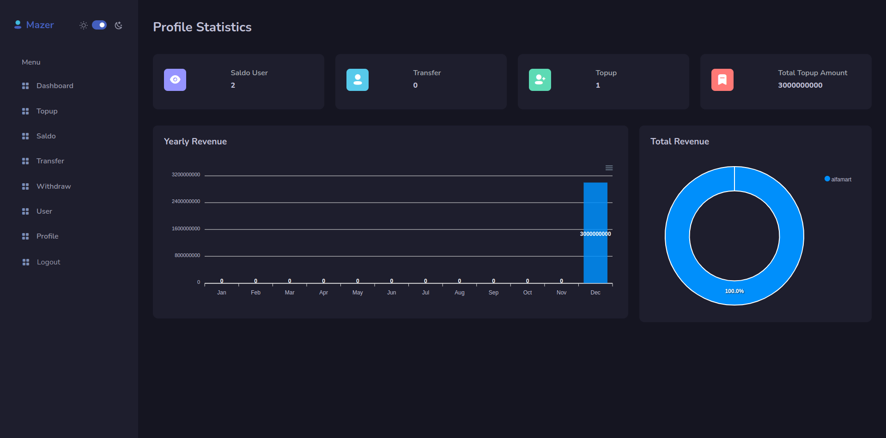

# Django Payment Gateway

Ini adalah program simpel aja, cara kerja payment gateway.

## Instalasi

Pastikan Anda memiliki Python dan Pipenv diinstal sebelum melanjutkan.

1. **Git Clone**
   ```sh
   git clone  https://github.com/MamangRust/django-payment-gateway.git

2. Masuk ke Direktori Proyek 
   ```sh
    cd django-payment-gateway
   ```
3. Install Dependencies
   ```sh
    pipenv install
   ```
4. Masuk ke Environment Pipenv
   ```sh
    pipenv shell
   ```
5. Jalakan Migrate
   ```sh
    python manage.py migrate
   ```
6. Jalakan Django
   ```sh
    python manage.py runserver
   ```

## Demo

